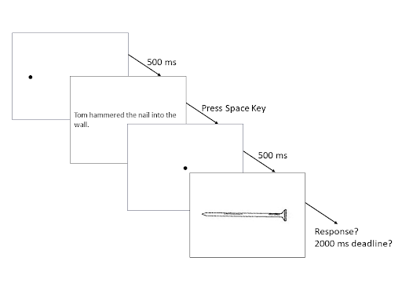
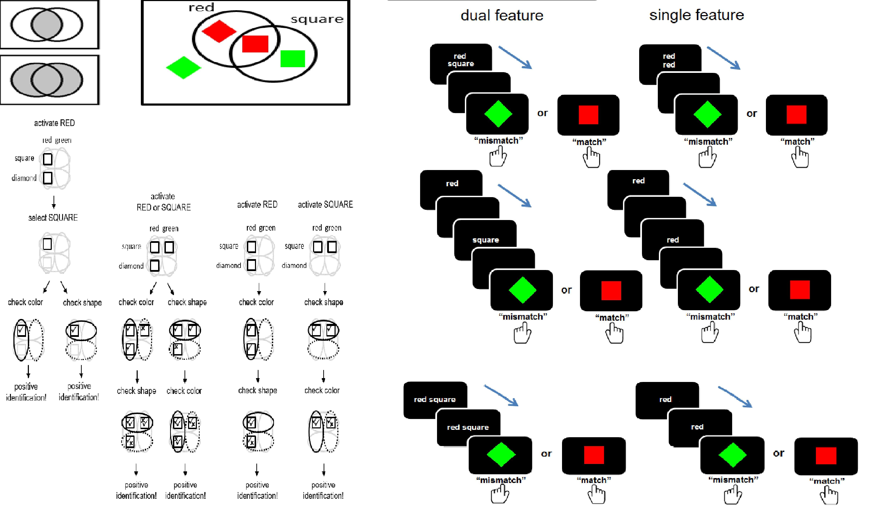
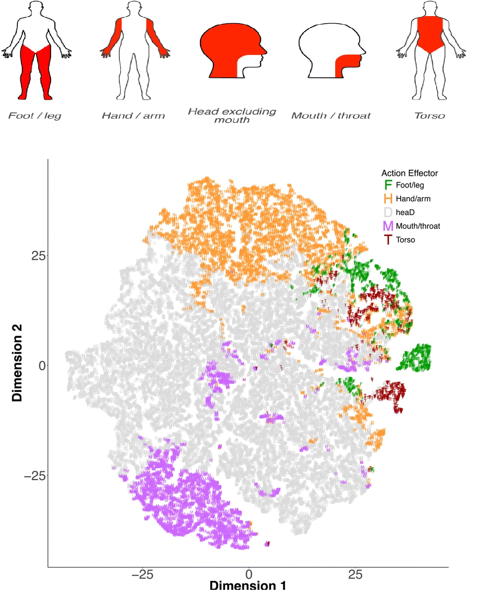

```{r setup, include=FALSE}
knitr::opts_chunk$set(echo = FALSE)
```


### How would the mental simulation of nominal phrase operate in the sentence?

```{r img01, fig.cap="句子-圖像辨識作業程序及刺激範例(Chen et al., under revision)。"}

```


- 句子中的名詞化短語啟動或增益心智模擬的條件
- 測量各式句子-圖像辨別作業的心智模擬效應
- 改進心智模擬效應的分析方法
	- 貝氏混合模型分析
	- 跨實驗整合分析
- 可估計心智模擬效應的計量模型

### How would a nominal phrase initiate mental simulation?

```{r img02, fig.cap="名詞化片語視覺化作業認知歷程假設及實驗程序(Bocanegra et al., 2022)。"}

```


- 名詞化短語表達特徵的視覺化歷程
- 測量視覺化作業的雙特徵效益/虧損條件
- 改進雙特徵效益/虧損的分析方法
- 可估計雙特徵效益/虧損的計量模型

### How could a nominal phrase initiate the strongest/weakest perceptual experience?


```{r img03, fig.cap="動作經驗量表及資料庫特徵向度分析(Lynott et al., 2020)。"}

```

- 名詞化短語的個體知覺及動作經驗
- 測量知覺經驗量表的最優知覺強度
- 改進最優知覺強度的分析方法
- 建立名詞化短語最優知覺強度的資料庫
